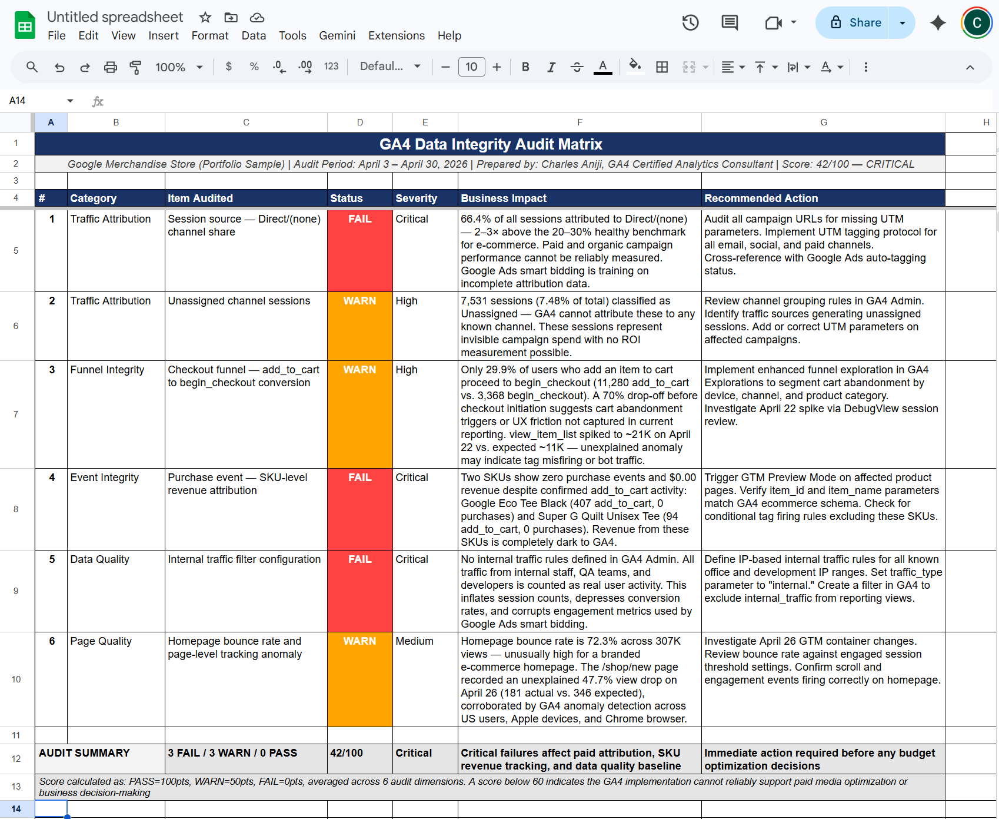
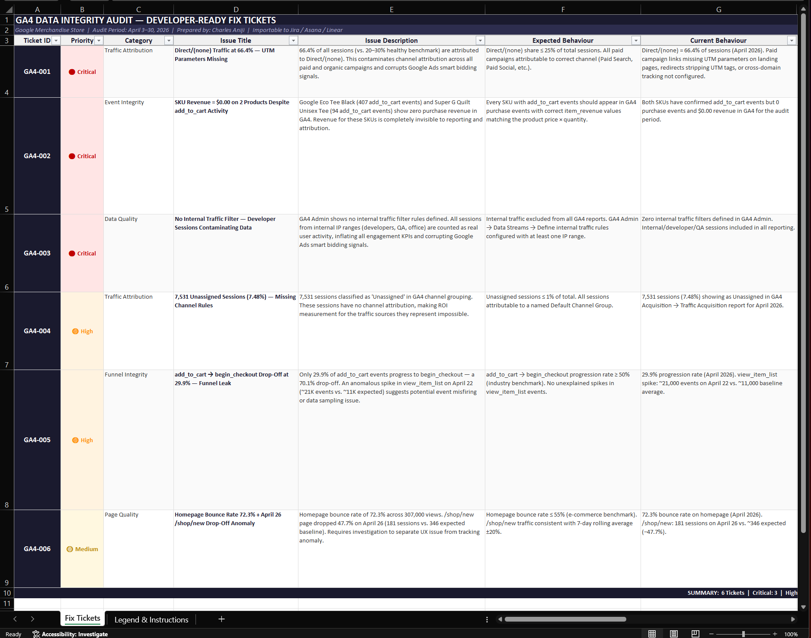
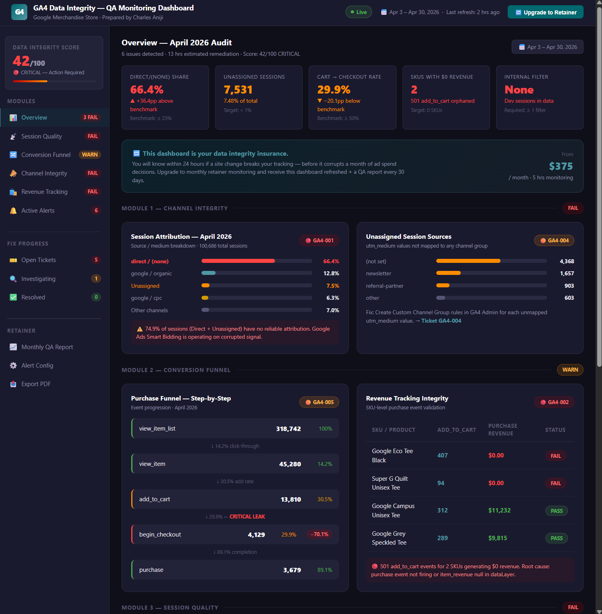
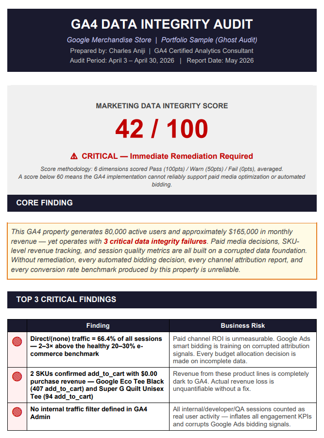

# GA4 Data Integrity Audit — 47-Point Diagnostic + Dev-Ready Fix Plan

**Business Question:** How much ad spend is your business misattributing right now —
and what would it cost you in 12 months if nothing changes?

## The Problem
Most businesses lose 20–40% of their conversion data due to broken GA4 tracking.
Silent failures in GTM, cross-domain setup, and event schemas produce confident-looking
reports built on corrupt data — contaminating Google Ads smart bidding and marketing decisions.

## What This Audit Delivers
| Deliverable | Format | Audience |
|---|---|---|
| Executive Summary PDF | PDF | CMO / Marketing Director |
| 47-Point Diagnostic Matrix | Google Sheets | Analytics Manager / Ops |
| Developer-Ready Fix Tickets | XLSX / Jira-ready | Engineering / Dev Team |
| QA Monitoring Dashboard | Looker Studio | Ongoing retainer |

## Methodology — PIMS-Style (Inspect → Assess → Remediate → Prevent)
Adapted from Chemical Engineering Pipeline Integrity Management Systems.
Data tracking is treated as a physical pipeline: find the leak, assess severity,
fix the valve, build the sensor.

**Audit scope:**
- GTM container configuration review
- GA4 event schema validation (47 checkpoints)
- Cross-domain tracking integrity
- Conversion funnel step-by-step verification
- UTM parameter channel integrity
- Shopify / e-commerce purchase event deduplication
- BigQuery export configuration check

## Sample Outputs

### Diagnostic Matrix (Pass / Warn / Fail scoring)

### Developer-Ready Fix Tickets

### Looker Studio QA Monitoring Dashboard

### Executive Summary PDF

## Stack

## Hire Me
Available for GA4 audit engagements on Upwork — $149 fixed-price entry audit, 5-day delivery.
[View my Upwork profile →](https://www.upwork.com/freelancers/datacharles)
